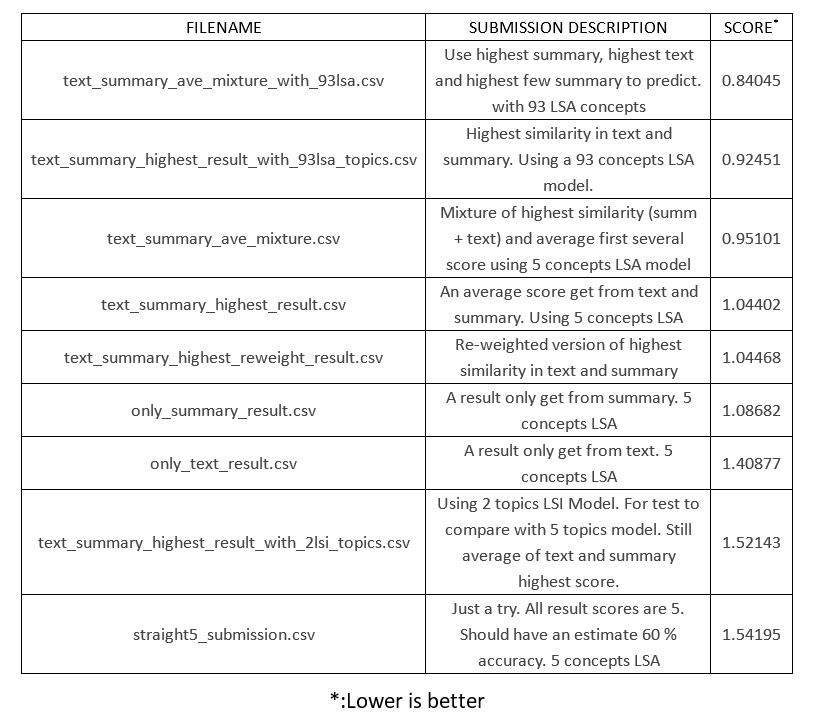

# CS565 Amazon Reviews prediction
Predict starts people give to a product, using exist data like summary, text, product ID, User ID...

This project is a in class project in Kaggle. 

To run code, please place train.csv under the main directory as main.py

Requirement:
    python3.5
    gensim
    tensorflow(optional)

Structure:
* main.py
    - classes: utils, dictionary, manipulate_comment_file, machien_learning_classifier, normal_classifiers
* Classifier.py
    - classes: classifier(Interface class), classifier_statistic, classifier_product_average, classifier_semantic_analysis_highest, classifier_semantic_analysis_average
* ProjectReport.docx 
    - A report about this project. More details, but don't copy this directly to yours. 
* Submission and History.zip
    - A submission and history record. Use mean root-square error to evaluate it. 
* Result.jpg
    - Record all method I tried and score it get. The lower the better. 

